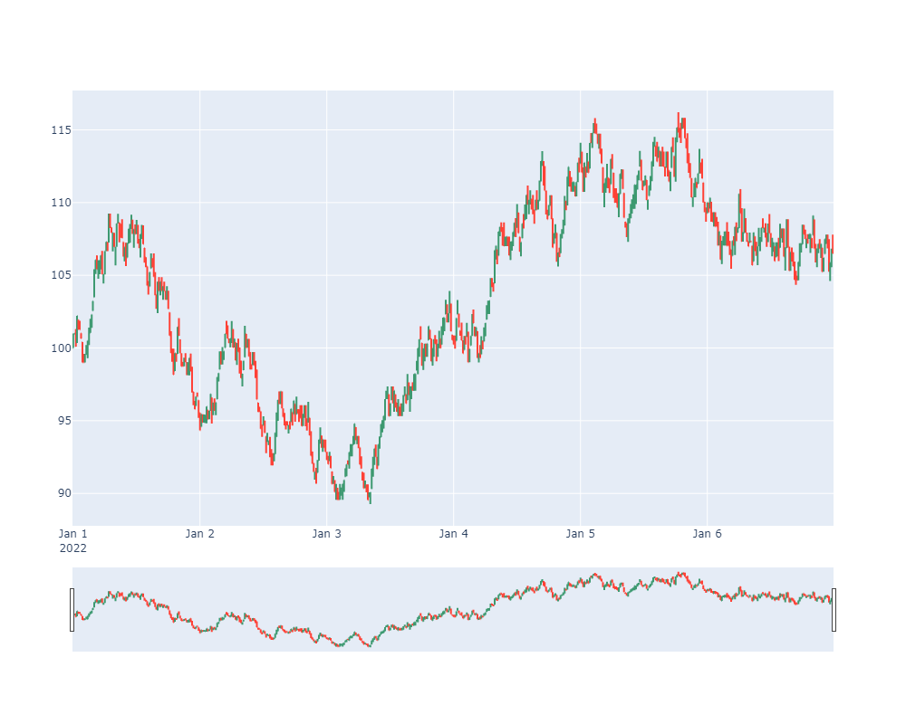

<!-- <p align="center" background-color='red' width="100%">
    
</p> -->

# 🚀qmrExchange (www.qmr.ai)🚀

- [🚀qmrExchange (www.qmr.ai)🚀](#qmrexchange-wwwqmrai)
  - [qmrExchange Overview](#qmrexchange-overview)
  - [Use cases for qmrExchange](#use-cases-for-qmrexchange)
  - [Potential Research Topics with qmrExchange](#potential-research-topics-with-qmrexchange)
    - [Market-Making Algorithms](#market-making-algorithms)
    - [Optimal Execution Algorithms](#optimal-execution-algorithms)
    - [Adversarial Algorithms](#adversarial-algorithms)
  - [Basig usage of qmrExchange](#basig-usage-of-qmrexchange)
    - [Import required libraries](#import-required-libraries)
    - [Declare basic parameters for the simulation](#declare-basic-parameters-for-the-simulation)
    - [Instantiate a Simulator](#instantiate-a-simulator)
    - [Add trading agents](#add-trading-agents)
    - [Run the simulation](#run-the-simulation)

## qmrExchange Overview
The qmrExchange project is an open-source financial markets exchange simulator that realistically mimics all the main components of modern trading venues. It allows us to test and quantify the behavior of different agents in a laboratory and isolated environment without the high noise-to-signal ratio that is otherwise unavoidable in live settings.
By creating a completely functioning trading venue whose access is only granted to a finite and known number of agents or trading algorithms, qmrExchange enables analyzing causation and quantifying the impact of each agent in a way that is otherwise unfeasible.


## Use cases for qmrExchange
The implementation of qmrExchange closely resembles the backend of most FIFO trading exchanges and replicates the market microstructure of the most popular venues. As a consequence, the system is especially useful for:
- Teaching, studying, and researching topics related to market microstructure and algorithmic trading.
- Estimating the impact of new regulations and how they affect each type of agent
- Implementing and analyzing market-making and high-frequency trading algorithms
-	Creating algorithmic trading challenges and tournaments both for university students and industry professionals alike


## Potential Research Topics with qmrExchange
Due to its precise resemblance to real-life trading venues, qmrExchange is perfectly suited for researching plenty of topics, such as:
### Market-Making Algorithms
By implementing a finite number of market participants, such as institutional investors and indicator-based trading algorithms, market-making algorithms can be studied. For a rigorous implementation, refer to Avellaneda & Stoikov (2008)
### Optimal Execution Algorithms
qmrExchange is an ideal environment for implementing, testing, and quantifying the market impact of different execution algorithms. By creating a laboratory, sterile and isolated venue whose market participants and their behavior is known with absolute certainty, optimal execution algorithms can be easily implemented, researched, and calibrated. For a formal presentation of such an algorithm, refer to Almgren & Chriss (1999).
### Adversarial Algorithms
Much like in the spirit of General Adversarial Networks and Game Theory, an implementation where a profit-maximizing agent’s behavior is calibrated based on the predefined behavior of other market participants is possible. For an interesting introduction to game theory applied to financial markets, refer to Allen & Morris (2022).

## Basig usage of qmrExchange
### Import required libraries

```
from source.qmr_exchange import Exchange
from random import Random
from source.qmr_exchange import Exchange, Simulator
from source.agents import RandomMarketTaker, NaiveMarketMaker
from datetime import datetime
```

### Declare basic parameters for the simulation
qmrExchange allows for simulating multiple tickers at once, for statistical arbitrage and high-frequency-trading simulations. In the present case, we simulate 1 week worth of 1 minute data (24/7 trading).

```
from_date = datetime(2022,1,1)
to_date = datetime(2022,1,7)
time_interval = 'minute'
tickers = ['XYZ']
```

### Instantiate a Simulator

```
sim = Simulator(from_date, to_date,time_interval)
sim.exchange.create_asset(tickers[0])
```

### Add trading agents
- We add a few naive market makers that create both buy and sell orders in each period. They set the price based on the last traded price and the specified spread percentage.
- We add a market taker that randomly buys and sells (based on the defined probabilities) on each period by means of market ordes (hence the word 'taker').

```
mm1 = NaiveMarketMaker(name='market_maker1', tickers=tickers, aum=10_000, spread_pct=0.005, qty_per_order=1)
mm2 = NaiveMarketMaker(name='market_maker2', tickers=tickers, aum=10_000, spread_pct=0.006,qty_per_order=1)
mm3 = NaiveMarketMaker(name='market_maker3', tickers=tickers, aum=10_000, spread_pct=0.007, qty_per_order=1)
mm4 = NaiveMarketMaker(name='market_maker4', tickers=tickers, aum=10_000, spread_pct=0.01, qty_per_order=1)

sim.add_agent(mm1)
sim.add_agent(mm2)
sim.add_agent(mm3)
sim.add_agent(mm4)

mt = RandomMarketTaker(name='market_taker', tickers=tickers, aum=10_1000, prob_buy=.2, prob_sell=.2, qty_per_order=2)
sim.add_agent(mt)
```

### Run the simulation

```
sim.run()
```

Retrieve all executed trades of our simulation

```
sim.trades
```

```
Output:

| dt                  | ticker   |   qty |   price | buyer         | seller        |
|:--------------------|:---------|------:|--------:|:--------------|:--------------|
| 2022-01-01 00:00:00 | XYZ      |     1 |  100    | init_seed     | init_seed     |
| 2022-01-01 00:00:00 | XYZ      |     1 |   99.75 | market_maker1 | market_taker  |
| 2022-01-01 00:00:00 | XYZ      |     1 |   99.7  | market_maker2 | market_taker  |
| 2022-01-01 00:01:00 | XYZ      |     1 |   99.95 | market_taker  | market_maker1 |
| 2022-01-01 00:01:00 | XYZ      |     1 |  100    | market_taker  | market_maker2 |
| 2022-01-01 00:05:00 | XYZ      |     1 |   99.75 | market_maker1 | market_taker  |
| 2022-01-01 00:05:00 | XYZ      |     1 |   99.7  | market_maker2 | market_taker  |
| 2022-01-01 00:09:00 | XYZ      |     1 |   99.95 | market_taker  | market_maker1 |
| 2022-01-01 00:09:00 | XYZ      |     1 |  100    | market_taker  | market_maker2 |
| 2022-01-01 00:10:00 | XYZ      |     1 |  100.25 | market_taker  | market_maker1 |
```

Group asset price in fixed 15 Minute OHLCV Bars

```
df_15min = sim.get_price_bars(bar_size='15Min')
```

```
Output:

| dt                  |   open |   high |   low |   close |   volume |
|:--------------------|-------:|-------:|------:|--------:|---------:|
| 2022-01-01 00:00:00 | 100    |  100.9 |  99.7 |   100.9 |       15 |
| 2022-01-01 00:15:00 | 100.65 |  101   | 100.6 |   101   |       16 |
| 2022-01-01 00:30:00 | 100.75 |  101.3 | 100.7 |   101.3 |       14 |
| 2022-01-01 00:45:00 | 101.05 |  101.6 |  99.8 |    99.8 |       18 |
| 2022-01-01 01:00:00 | 100.05 |  100.1 |  99.2 |    99.2 |       12 |
| 2022-01-01 01:15:00 |  99.45 |   99.9 |  99   |    99   |       18 |
| 2022-01-01 01:30:00 |  99    |   99.9 |  99   |    99.9 |       16 |
| 2022-01-01 01:45:00 | 100.15 |  100.2 |  98.7 |    98.7 |       12 |
| 2022-01-01 02:00:00 |  98.95 |   99.3 |  98.7 |    99.3 |        8 |
| 2022-01-01 02:15:00 |  99.05 |   99.3 |  98.7 |    99   |       10 |
```

Create a candlestick plot of the aggregated bar data

```
from source.helpers import plot_bars
plot_bars(df_15min)
```




